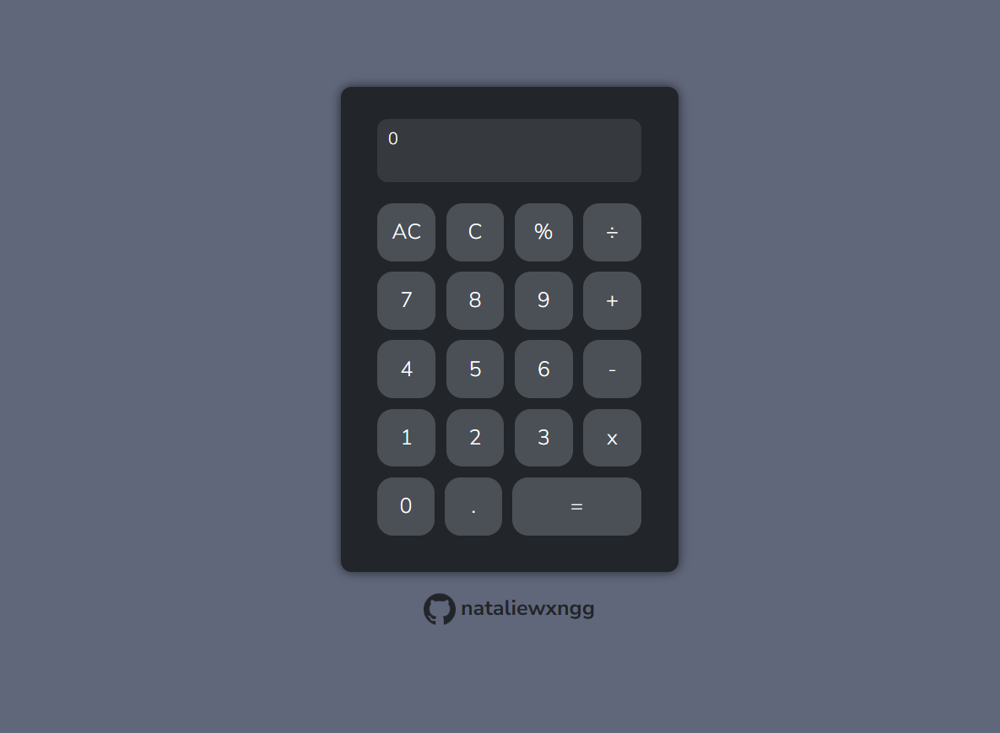

<h1>Calculator</h1>

Natalie Wong | January 11, 2025

This calculator is created using vanilla HTML, CSS, and JavaScript as part of <a href="https://www.theodinproject.com/dashboard">The Odin Project</a>'s Foundations curriculum.
It features basic arithmetic functionality with robust error handling to ensure precise calculations. Moreover, it includes animations and a comprehensive UI that provides a promising user experience.
